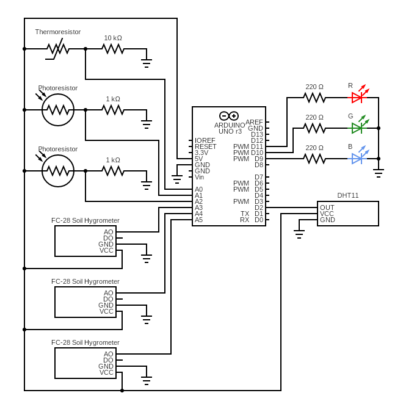

# Flowey - Plant monitoring system with Telegram chat and web interface

### IOT project for UNIMORE

---

## Who is Flowey?
Flowey is the buddy you need to keep your plants alive! 
Ever wondered how to talk to a plant? 
Flowey gives you the opportunity!
Just set up the sensors in the vase and start communicating 
with your plant through Telegram, or access all the data 
trough the website.
No more guessing if the plant needs water, 
if it's too cold or if it needs to be placed in another spot. 
Flowey will tell you if everything it's okay or if it needs 
some adjustments.

## About the Project
Flowey is part of the project for the exam 
"Informatica Industriale e IOT" for the Computer Engineering 
degree in UNIMORE.
We are a team of 3 people who can't seem to keep one single 
plant alive, not even a cactus, and we decided to invent a 
system to help us in our "leafy" journey.
The idea is to extend the IOT paradigm to an object which 
can be found in many households, our plants.

## How does it work
Flowey's systems is composed of various sensors that can 
be mounted directly on your plant's vase,to monitor humidity, 
temperature and luminosity, giving a well rounded idea of 
the plant well being.The data read by the sensors is collected 
by an Arduino and sent to a RaspberryPi that serves as the 
bridge using a Serial connection.
While developing we only used one Arduino and one RaspberryPi 
but there is no real limit to the number of bridges and gateways, 
since the system is scalable.
The bridge does some elaboration on the data and then sends 
everything to the Datacenter, that stores the data in 
MySQL database, hosted on PythonAnywhere.
Flask is installed on our local pc and is used as datacenter. 
It hosts the REST API (used to connect to telegram and to 
the database) and the grafic interface to dispay the data 
through graphs.


*For more information about the project read the whole 
[document here](https://docs.google.com/document/d/1NNB9fvqPyqg2SD_VwvQb1ESI88l5bCgdshtuKrfREr8/edit?usp=sharing) 
(only in italian)*

---

## Flowey Installation

This project consists of three main parts:

- **Gateway**
  - It is the device that gathers data from the sensors 
  and then sends it to the bridge to which it is connected.

- **Bridge**
  - It is the device that receives data from connected gateways
  and then sends it to the datacenter.
  
- **Datacenter**
  - It is the central server that receives data from the bridges
  and provides various means of data access and visualization.

---

### Gateway installation
The code that pertains to the gateway is located into the `gateway` folder
and expects to be run on an Arduino or similar device.

Load `manager.ino` into your device, and make sure to include the provided
`libraries/DHT` library.
(Follow the [documentation](https://docs.arduino.cc/software/ide-v1/tutorials/installing-libraries)
to know how to do that.)

Connect the data sensors into your device following this schema:

*Gateway Diagram*

You can then use a USB Serial cable to connect the gateway to a bridge.

---

### Bridge installation
The code that pertains to the bridge is located into the `bridge` folder
and requires a Python 3 installation.

Copy the contents of `bridge` into a folder on your bridge device:
```shell
cd <folder/that/will/contain/Flowey>
git clone --depth 1 --filter=blob:none --sparse https://github.com/Poppy3/Progetto-IoT
cd Progetto-IoT
git sparse-checkout set bridge
cd bridge
```

Install required Python packages by running
```shell
pip install -r requirements.txt
```

#### Register and manage gateway connections
`bridge/setup.py` is the script that handles new and existing gateway connections.
Connections are stored into a `bridge/connections_storage.json` file.
```shell
# show script help page (also -h)
python3 setup.py --help
# query existing Plant Types (also -T)
python3 setup.py --type-list
# register new plant and gateway (also -a, -t, -p, -b)
python3 setup.py --add --type <TYPE> --serial-port <PORT> --serial-baudrate <BAUDRATE>
# list all existing gateway connections (also -l)
python3 setup.py --list
# delete a gateway connections (also -d, -t, -p, -b)
python3 setup.py --delete --type <TYPE> --serial-port <PORT> --serial-baudrate <BAUDRATE>
# delete ALL gateway connections (also -D)
python3 setup.py --delete-all
```

#### Main process
`bridge/main.py` is the script that handles the main process.
To function it requires that at least one gateway has been registered.

```shell
# as foreground process
python3 main.py

# or as background process
python3 main.py & disown
```

*Hint:* The bridge can also be configured to launch `bridge/start.sh`
at startup to automatically start the main process.

---

### Datacenter installation
The code that pertains to the datacenter is located into the 
`server` folder and requires a Python 3 installation.

Copy the contents of `server` into a folder on your designed device:
```shell
cd <folder/that/will/contain/Flowey>
git clone --depth 1 --filter=blob:none --sparse https://github.com/Poppy3/Progetto-IoT
cd Progetto-IoT
git sparse-checkout set server
cd server
```

Install required Python packages by running
```shell
pip install -r requirements.txt
```

#### Start main server
This starts the main server (in development mode only, *for now...*)

```shell
flask run
```
